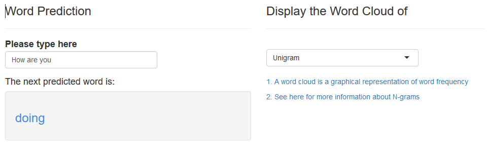
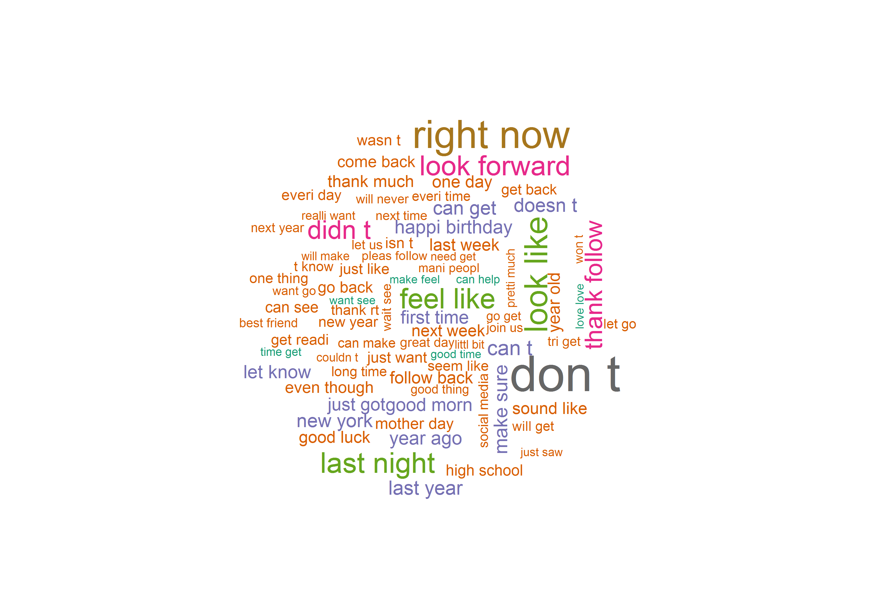

```{r setup, include=FALSE}
knitr::opts_chunk$set(echo = FALSE)
```

## What does this app do

- Input: Any Phrase (e.g. How are you)
- Output: The predicted next word (e.g. doing)

[Click here for the app](http://varianceexplained.org/r/trump-tweets/)
[Check the Github]()

<!--  -->
```{r, out.width = "600px"}

```

Built by 

```{r, out.width = "100px"}

```
            
## Data

- [SwiftKey](https://d396qusza40orc.cloudfront.net/dsscapstone/dataset/Coursera-SwiftKey.zip)
- Contains: Twitter, Blogs, News
- Clean/Compressed data: Shrink from over 550MB to 32MB

  - remove words with non-ASCII characters 
  - convert to lower cases
  - remove punctuation
  - remove extra white spaces
  - remove unmeaningful repeated words
  - remove number
  - remove URL, websites, email
  - remove profanity words
  
## N-gram Models
[N-grams](https://en.wikipedia.org/wiki/N-gram) are created to explore word frequencies.

- Unigram, Bi-gram, Tri-gram, and Four-gram are used

```{r, out.width = "600px"}

```
```{r, out.width = "600px"}

```

## Efficient Prediction Algorithm

To improve the efficiency of prediction

- [Stupid Backoff Model](https://en.wikipedia.org/wiki/Katz%27s_back-off_model)
- Markov Chain: Calculate the conditional probability of the phrase
- Hasing: stores words as indexes, not strings
- Prediction time: < 0.1s


